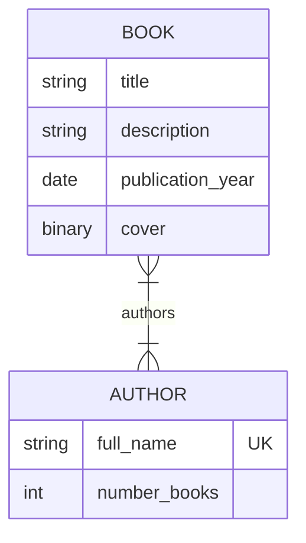

```mermaid
---
Database Model
---
erDiagram
  BOOK |{--}| AUTHOR : authors
  BOOK {
    string title
    string description
    date publication_year
    binary cover
  }
  AUTHOR {
    string full_name UK
    int number_books
  }
```

Author full-name is unique \
book.authors = ({id, author_fullname}, ...) \
author.book_list = ({id, book_title, publication_year}, ...)
